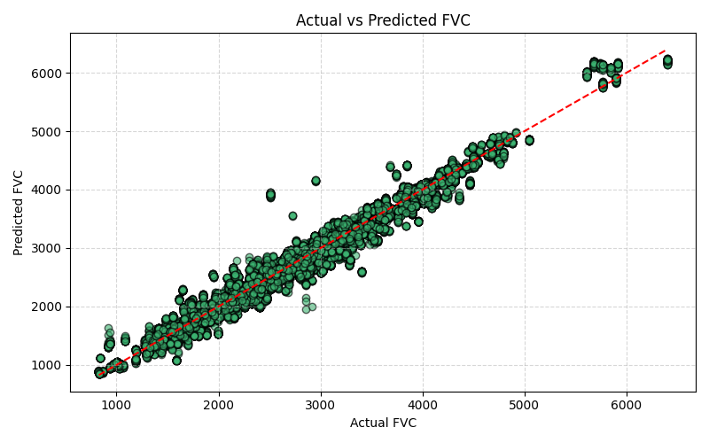

# IPF Detection using Machine Learning

> Early detection of Idiopathic Pulmonary Fibrosis (IPF) using CT scan images and tabular clinical data, implemented with dual-branch deep learning models.

---

## 🩺 Project Overview

Idiopathic Pulmonary Fibrosis (IPF) is a chronic lung disease that leads to scarring (fibrosis) of the lungs and severely impacts respiratory function. This project proposes a multimodal machine learning system to predict Forced Vital Capacity (FVC) from:

- **Lung CT scan images** (DICOM → PNG)
- **Clinical tabular data** (Age, Sex, Smoking Status, etc.)

We built and evaluated two models:
-  `EFFICIENTNETB0.ipynb`
-  `MOBILENET_V3_LARGE.ipynb`

---

## 📁 Repository Contents

| File / Folder              | Description                                            |
|----------------------------|------------------------------------------------------- |
| `EFFICIENTNETB0.ipynb`     | Model training using EfficientNetB0                    |
| `MOBILENET_V3_LARGE.ipynb` | Model training using MobileNetV3-Large                 |
| `images/`                  | Folder for storing architecture and result visuals     |
| `README.md`                | Project documentation                                  |
| `requirements.txt`         | Python dependencies                                    |

---

## 🧠 Methodology

### 🔹 Data Pipeline

1. **DICOM to PNG conversion**  
   - Applied lung window preprocessing and finally converted dcm to png
   - Saved 2D lung slices for model training

2. **Custom Data Generator** for parallel loading of:
   - Preprocessed CT images
   - Tabular clinical features

### 🔹 Model Architecture

- **Dual-Branch Network**:
  - CNN branch: Extracts features from CT slices
  - FCN branch: Processes clinical tabular data
  - Merged for FVC regression output


---

## 📊 Results

### EfficientNetB0 Model
- MAE ->      105.31
- RMSE ->     149.44
- R^2 Score-> 0.9723


### MobileNetV3-Large Model
- MAE ->      121.00
- RMSE ->     168.73
- R^2 Score-> 0.9647


### 📉 FVC Prediction vs Ground Truth




---

## 💾 Dataset

  Dataset which is used is from the [Kaggle OSIC Pulmonary Fibrosis Progression Challenge](https://www.kaggle.com/competitions/osic-pulmonary-fibrosis-progression), which includes:

- CT scan slices (DICOM format)
- Patient metadata (age, sex, smoking status, etc.)
- Time-stamped FVC measurements

> **Note**: Dataset is not included in this repo due to privacy constraints.

---

## ⚙️ Installation & Setup

1. **Clone the repository**:
   ```bash
   git clone https://github.com/sagar-24bytes/IPF-Detection-using-ML.git
   cd IPF-Detection-using-ML
   ```


2. **Install dependencies**:
   ```bash
   pip install -r requirements.txt
   ```
   

3. **Run the notebooks**:
    
  - Open EFFICIENTNETB0.ipynb or MOBILENET_V3_LARGE.ipynb in Jupyter or VS Code.

  - Adjust dataset paths if necessary.

  - Run all cells to train/evaluate the models.  

## 👨‍💻 Author
**Sagar Chandra**
**AI/ML Enthusiast**

- GitHub:  sagar-24bytes

- Linkedin: sagar-chandra07

## 📝 License

This project is licensed under the [MIT License](LICENSE) — see the LICENSE file for details.
